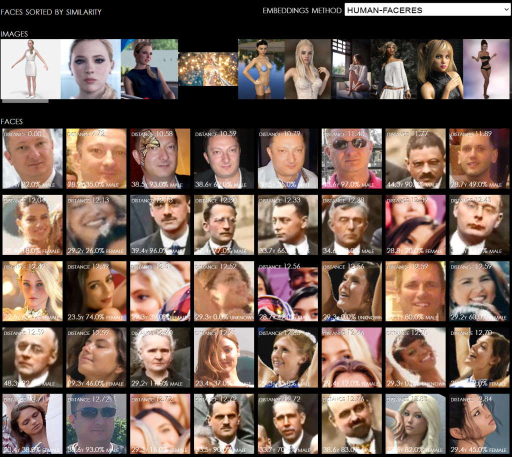

# InsightFace for TFJS

TFJS port of InsightFace

## Models

Repository contains pretrained **TFJS graph models** for the following **InsightFace** variations  

- `human-faceres`: *included for reference*, 6.7MB weights
- `insightface-mobilenet-emore`: 6.7MB weights, 1.6ms avg
- `insightface-mobilenet-swish`: 12MB weights, 3.0ms avg
- `insightface-ghostnet-strides1`: 7.8MB weighs, 9.3ms avg
- `insightface-ghostnet-strides2`: 7.7MB weights, 7.4ms avg
- `insightface-efficientnet-b0`: 13MB weights, 9.8ms avg

### Notes
- Models have been quantized to **F16** for size  
- All models take `[1, 112, 112, 3]` cropped and normalized `[0..1]` image of a face as input  
  and produce as single float array as output which represents face embedding  
- Performance numbers are using RTX3060  

## Demo & Compare

Demo app in `/src` uses `Human` library to detect and crop faces from input images before running `InsightFace` models to calculate face descriptors (embeddings)  

And yes, you can use any other face detection method  

### Sample Images

GitHub repository is void of sample images, beforing running demo place any number of images of any resolution containing one or more faces into `/assets/samples/`

## Sample Screenshot

### Run

Use built-in dev server to compile sources and start a web server:

> npm run dev

## Credits

- Original implementation: <https://github.com/deepinsight/insightface>
- Keras port: <https://github.com/leondgarse/Keras_insightface>

## TBD

- Optimize `similarity` in (%) from raw `distance`
- Find best `face.scale` per model
